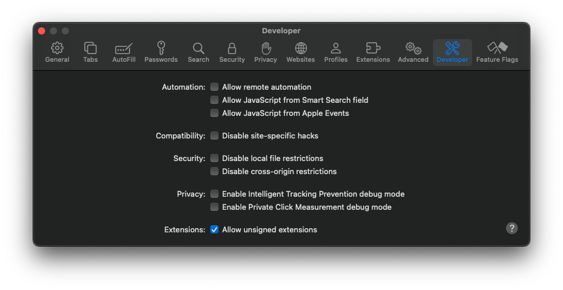
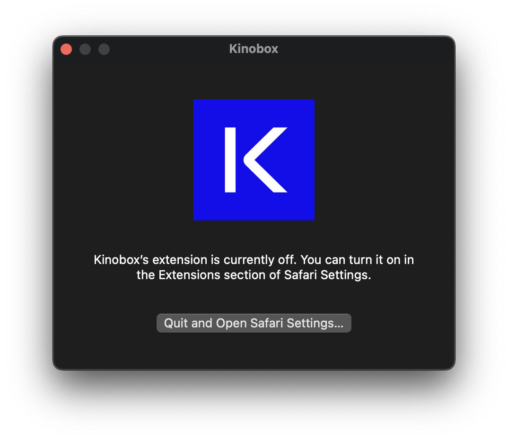
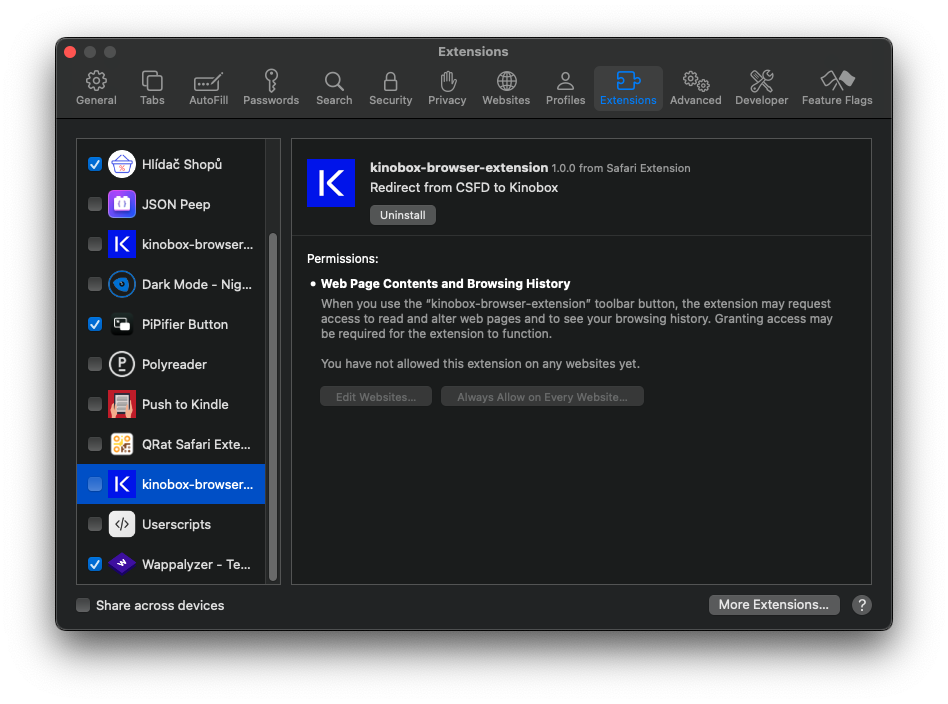

# Build for Safari

1. Open Safari Settings
2. Navigate to `Developer`
3. Allow: `Allow unsigned extensions`
4. Run following build script

   ```bash
   ./tools/safari.sh "Kinobox" "io.github.landsman.kinobox"
   ```

5. It will open xCode automatically
6. Click to Run icon - it will build and attach extension to the Safari
7. Click to button from the app
8. Allow Extension in the Safari settings
9. Allow Permission for accessing all websites
10. Done!






